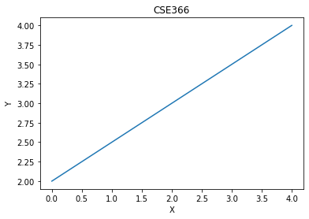
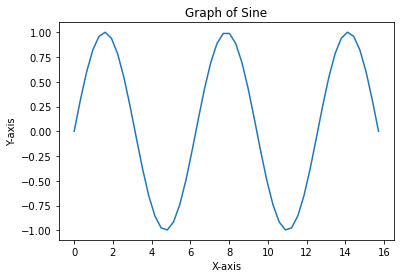
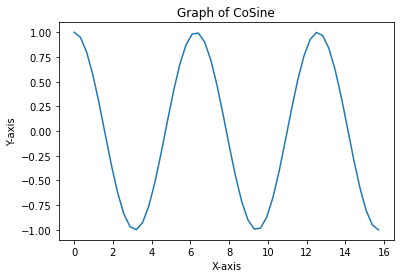
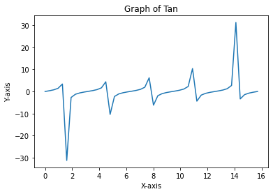

## Loop


```python
x_val = [1,2,3]
for x in x_val: ## Looping without indices
    print(x)
```

    1
    2
    3
    


```python
for i in range(len(x_val)):## Lopping with indices
    print(x_val[i])
```

    1
    2
    3
    

## Zip()


```python
names =['A','B']
marks = ['C','D']
dict(zip(names, marks))
```


    {'A': 'C', 'B': 'D'}


```python
district = ('jashore', 'Kushtia', 'Khulna', 'Pabna', 'Natore')
toun = ('Rajshahi','Sylhet','Barisal','Dhaka','Chottagone')

for dist,toun in zip(district,toun):
    print(f'The district {dist} and corresponding city {toun}')
```

    The district jashore and corresponding city Rajshahi
    The district Kushtia and corresponding city Sylhet
    The district Khulna and corresponding city Barisal
    The district Pabna and corresponding city Dhaka
    The district Natore and corresponding city Chottagone
    


```python
for index, number in enumerate(x_val):
    print(f'xa_val [{index}] = {number}')
```

    xa_val [0] = 1
    xa_val [1] = 2
    xa_val [2] = 3
    

## Function


```python
def f(string):
    count = 0
    for letter in string:
        if letter == letter.upper() and letter.isalpha():
            count +=1
    return  count
f('Winter Is Beautiful But Scary')        
```


    5


```python
from scipy.integrate import quad
```


```python
def f(x):
    return x**3
f= (lambda x:x**3)(3)
f
```


    27


```python
import numpy as np
```


```python
a = np.zeros(10)
```


```python
a
```


    array([0., 0., 0., 0., 0., 0., 0., 0., 0., 0.])


```python
type(a)
```


    numpy.ndarray


```python
a.shape=(5,2)
a
```


    array([[0., 0.],
           [0., 0.],
           [0., 0.],
           [0., 0.],
           [0., 0.]])


```python
a = np.linspace(2,4,5)
a
```


    array([2. , 2.5, 3. , 3.5, 4. ])


## matrix


```python
x = np.identity(4)
x
```


    array([[1., 0., 0., 0.],
           [0., 1., 0., 0.],
           [0., 0., 1., 0.],
           [0., 0., 0., 1.]])


```python
a = np.array([10,20], dtype = float)
a
```


    array([10., 20.])


```python
z = np.linspace(1,2,5)
z[0]
```


    1.0


```python
z[-1]
```


    2.0


```python
b= np.array([[1,2],[3,4]])
b
```


    array([[1, 2],
           [3, 4]])


```python
b[0,1]
```


    2


```python
b[0,:]
```


    array([1, 2])


```python
b[:,1]
```


    array([2, 4])


```python
d=np.array ((12,16))
e= np.array((13,17))
d@e
```


    428


```python
a=np.random.randn(5)
a
```


    array([ 0.70799598,  1.17800244,  0.95121211, -1.11469393, -0.98758995])


```python
b = a
b[0] = 0.0
```


```python
b
```


    array([ 0.        , -0.84906238, -0.45539763, -0.26656456, -1.08647744])


```python
b = np.copy(a)
a
```


    array([-0.94547129,  0.79047984,  0.32832408,  0.40117713, -0.55353804])


```python
import matplotlib.pyplot as plt
```


```python
plt.plot(a)
plt.title('CSE366')
plt.xlabel('X')
plt.ylabel('Y')
plt.show()
```


    

    


```python
x= np.array([1,2,3])
np.sin(x)
```


    array([0.84147098, 0.90929743, 0.14112001])


```python
np.sqrt(2*np.pi)
```


    2.5066282746310002


```python
def f(x):
    return 1 if x> 0 else 0
```


```python
f(2)
```


    1


```python
np.where (x>0,1,0)
```


    array([1, 1, 1])


```python
f = np.vectorize(f)
f(x)
```


    array([1, 1, 1])


# Exercise Lab 3

## 1) Find root of ax^2 + bx + c, consider fixed x value but take multiple values for coeffs. Hints: def f(x, coeff), coeff = (2, 1).


```python
import cmath
```


```python
def foo(x, coeff): #here x is the fixed value and in coeff there are 2 coefficient
    d = (coeff[1]**2) - (4*coeff[0]*x)
    root1 = (-coeff[1]-cmath.sqrt(d))/(2*coeff[0])
    root2 = (-coeff[1]+cmath.sqrt(d))/(2*coeff[0])
    print('solutions: ',root1,' and ',root2)

coeff = (2,1) #tuple
x=1
foo(x,coeff)
```

    solutions:  (-0.25-0.6614378277661477j)  and  (-0.25+0.6614378277661477j)
    

## 2) Write a function in Python which takes two sequences as arguments and returns True if every element in a sequence is also an element of second sequnce, else False.'''


```python
def c_data(seq1, seq2):
     result = False
     for i in seq1:
        for j in seq2:
            if (i == j):
                 return True
            else:
                return False

a=[10,20,30,40,50]
b=[10,20,30,40,60]
print(c_data(a,b))
            
```

    True
    

## 3) Plot sin, cosine, and tan function using np library. Use linspace to generate values.


```python
import numpy as np
import matplotlib.pyplot as plt
```

### Sine Graph


```python
x=np.linspace(0,5*np.pi)
y=np.sin(x)
plt.plot(x,y)
plt.title('Graph of Sine')
plt.xlabel('X-axis')
plt.ylabel('Y-axis')
plt.show()
```


    

    


### Cos Graph


```python
x=np.linspace(0,5*np.pi)
y=np.cos(x)
plt.plot(x,y)
plt.title('Graph of CoSine')
plt.xlabel('X-axis')
plt.ylabel('Y-axis')
plt.show()
```


    

    


### Tan Graph


```python
x=np.linspace(0,5*np.pi)
y=np.tan(x)
plt.plot(x,y)
plt.title('Graph of Tan')
plt.xlabel('X-axis')
plt.ylabel('Y-axis')
plt.show()
```


    

    


```python

```


```python

```
