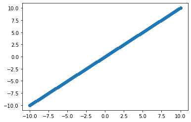
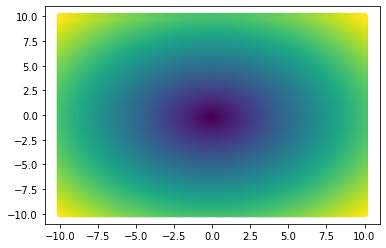
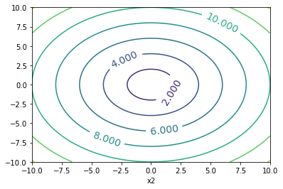
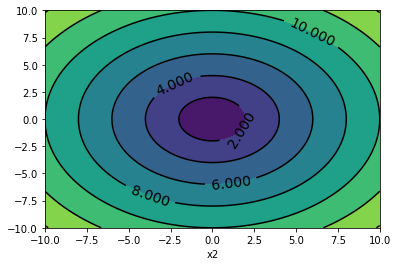
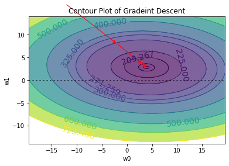

```python
import numpy as np
import matplotlib.pyplot as plt
```


```python
x1 = np.linspace(-10.0,10.0,100)
x2 = np.linspace(-10.0,10.0,100)
```


```python
plt.scatter(x1,x2)
plt.show()
```


    

    


## np.meshgrid()


```python
a= np.array((1,2,3))
a1,a2 = np.meshgrid(a,a)
print(a1)
print(a2)
```

    [[1 2 3]
     [1 2 3]
     [1 2 3]]
    [[1 1 1]
     [2 2 2]
     [3 3 3]]
    


```python
x1, x2 = np.meshgrid(x1,x2)
y = np.sqrt(np.square(x1)+ np.square(x2))
```


```python
cm= plt.get_cmap('viridis')
plt.scatter(x1,x2,c = y, cmap= cm)
plt.show()
```


    

    


## Contour Plot


```python
cp = plt.contour(x1,x2,y)
plt.clabel(cp,inline=1,fontsize= 14)
plt.xlabel('x1')
plt.xlabel('x2')
plt.show()
```


    

    


```python
cp = plt.contour(x1,x2,y,colors='black', linestyle='dashed')
plt.clabel(cp,inline=1,fontsize= 14)
cp = plt.contourf(x1,x2,y,)
plt.xlabel('x1')
plt.xlabel('x2')
plt.show()
```

    <ipython-input-8-189cb1057b79>:1: UserWarning: The following kwargs were not used by contour: 'linestyle'
      cp = plt.contour(x1,x2,y,colors='black', linestyle='dashed')
    


    

    


# Gradient Descent Algorithm


```python
pip install pandas
```

    Requirement already satisfied: pandas in c:\programdata\anaconda3\lib\site-packages (1.2.4)Note: you may need to restart the kernel to use updated packages.
    Requirement already satisfied: pytz>=2017.3 in c:\programdata\anaconda3\lib\site-packages (from pandas) (2021.1)
    Requirement already satisfied: python-dateutil>=2.7.3 in c:\programdata\anaconda3\lib\site-packages (from pandas) (2.8.1)
    Requirement already satisfied: numpy>=1.16.5 in c:\programdata\anaconda3\lib\site-packages (from pandas) (1.20.1)
    Requirement already satisfied: six>=1.5 in c:\programdata\anaconda3\lib\site-packages (from python-dateutil>=2.7.3->pandas) (1.15.0)
    
    


```python
import pandas as pd
from sklearn.preprocessing import StandardScaler
import numpy as np
```


```python
data = pd.read_csv('Advertising.csv')

print(data.to_string()) 
```

         Unnamed: 0     TV  Radio  Newspaper  Sales
    0             1  230.1   37.8       69.2   22.1
    1             2   44.5   39.3       45.1   10.4
    2             3   17.2   45.9       69.3    9.3
    3             4  151.5   41.3       58.5   18.5
    4             5  180.8   10.8       58.4   12.9
    5             6    8.7   48.9       75.0    7.2
    6             7   57.5   32.8       23.5   11.8
    7             8  120.2   19.6       11.6   13.2
    8             9    8.6    2.1        1.0    4.8
    9            10  199.8    2.6       21.2   10.6
    10           11   66.1    5.8       24.2    8.6
    11           12  214.7   24.0        4.0   17.4
    12           13   23.8   35.1       65.9    9.2
    13           14   97.5    7.6        7.2    9.7
    14           15  204.1   32.9       46.0   19.0
    15           16  195.4   47.7       52.9   22.4
    16           17   67.8   36.6      114.0   12.5
    17           18  281.4   39.6       55.8   24.4
    18           19   69.2   20.5       18.3   11.3
    19           20  147.3   23.9       19.1   14.6
    20           21  218.4   27.7       53.4   18.0
    21           22  237.4    5.1       23.5   12.5
    22           23   13.2   15.9       49.6    5.6
    23           24  228.3   16.9       26.2   15.5
    24           25   62.3   12.6       18.3    9.7
    25           26  262.9    3.5       19.5   12.0
    26           27  142.9   29.3       12.6   15.0
    27           28  240.1   16.7       22.9   15.9
    28           29  248.8   27.1       22.9   18.9
    29           30   70.6   16.0       40.8   10.5
    30           31  292.9   28.3       43.2   21.4
    31           32  112.9   17.4       38.6   11.9
    32           33   97.2    1.5       30.0    9.6
    33           34  265.6   20.0        0.3   17.4
    34           35   95.7    1.4        7.4    9.5
    35           36  290.7    4.1        8.5   12.8
    36           37  266.9   43.8        5.0   25.4
    37           38   74.7   49.4       45.7   14.7
    38           39   43.1   26.7       35.1   10.1
    39           40  228.0   37.7       32.0   21.5
    40           41  202.5   22.3       31.6   16.6
    41           42  177.0   33.4       38.7   17.1
    42           43  293.6   27.7        1.8   20.7
    43           44  206.9    8.4       26.4   12.9
    44           45   25.1   25.7       43.3    8.5
    45           46  175.1   22.5       31.5   14.9
    46           47   89.7    9.9       35.7   10.6
    47           48  239.9   41.5       18.5   23.2
    48           49  227.2   15.8       49.9   14.8
    49           50   66.9   11.7       36.8    9.7
    50           51  199.8    3.1       34.6   11.4
    51           52  100.4    9.6        3.6   10.7
    52           53  216.4   41.7       39.6   22.6
    53           54  182.6   46.2       58.7   21.2
    54           55  262.7   28.8       15.9   20.2
    55           56  198.9   49.4       60.0   23.7
    56           57    7.3   28.1       41.4    5.5
    57           58  136.2   19.2       16.6   13.2
    58           59  210.8   49.6       37.7   23.8
    59           60  210.7   29.5        9.3   18.4
    60           61   53.5    2.0       21.4    8.1
    61           62  261.3   42.7       54.7   24.2
    62           63  239.3   15.5       27.3   15.7
    63           64  102.7   29.6        8.4   14.0
    64           65  131.1   42.8       28.9   18.0
    65           66   69.0    9.3        0.9    9.3
    66           67   31.5   24.6        2.2    9.5
    67           68  139.3   14.5       10.2   13.4
    68           69  237.4   27.5       11.0   18.9
    69           70  216.8   43.9       27.2   22.3
    70           71  199.1   30.6       38.7   18.3
    71           72  109.8   14.3       31.7   12.4
    72           73   26.8   33.0       19.3    8.8
    73           74  129.4    5.7       31.3   11.0
    74           75  213.4   24.6       13.1   17.0
    75           76   16.9   43.7       89.4    8.7
    76           77   27.5    1.6       20.7    6.9
    77           78  120.5   28.5       14.2   14.2
    78           79    5.4   29.9        9.4    5.3
    79           80  116.0    7.7       23.1   11.0
    80           81   76.4   26.7       22.3   11.8
    81           82  239.8    4.1       36.9   12.3
    82           83   75.3   20.3       32.5   11.3
    83           84   68.4   44.5       35.6   13.6
    84           85  213.5   43.0       33.8   21.7
    85           86  193.2   18.4       65.7   15.2
    86           87   76.3   27.5       16.0   12.0
    87           88  110.7   40.6       63.2   16.0
    88           89   88.3   25.5       73.4   12.9
    89           90  109.8   47.8       51.4   16.7
    90           91  134.3    4.9        9.3   11.2
    91           92   28.6    1.5       33.0    7.3
    92           93  217.7   33.5       59.0   19.4
    93           94  250.9   36.5       72.3   22.2
    94           95  107.4   14.0       10.9   11.5
    95           96  163.3   31.6       52.9   16.9
    96           97  197.6    3.5        5.9   11.7
    97           98  184.9   21.0       22.0   15.5
    98           99  289.7   42.3       51.2   25.4
    99          100  135.2   41.7       45.9   17.2
    100         101  222.4    4.3       49.8   11.7
    101         102  296.4   36.3      100.9   23.8
    102         103  280.2   10.1       21.4   14.8
    103         104  187.9   17.2       17.9   14.7
    104         105  238.2   34.3        5.3   20.7
    105         106  137.9   46.4       59.0   19.2
    106         107   25.0   11.0       29.7    7.2
    107         108   90.4    0.3       23.2    8.7
    108         109   13.1    0.4       25.6    5.3
    109         110  255.4   26.9        5.5   19.8
    110         111  225.8    8.2       56.5   13.4
    111         112  241.7   38.0       23.2   21.8
    112         113  175.7   15.4        2.4   14.1
    113         114  209.6   20.6       10.7   15.9
    114         115   78.2   46.8       34.5   14.6
    115         116   75.1   35.0       52.7   12.6
    116         117  139.2   14.3       25.6   12.2
    117         118   76.4    0.8       14.8    9.4
    118         119  125.7   36.9       79.2   15.9
    119         120   19.4   16.0       22.3    6.6
    120         121  141.3   26.8       46.2   15.5
    121         122   18.8   21.7       50.4    7.0
    122         123  224.0    2.4       15.6   11.6
    123         124  123.1   34.6       12.4   15.2
    124         125  229.5   32.3       74.2   19.7
    125         126   87.2   11.8       25.9   10.6
    126         127    7.8   38.9       50.6    6.6
    127         128   80.2    0.0        9.2    8.8
    128         129  220.3   49.0        3.2   24.7
    129         130   59.6   12.0       43.1    9.7
    130         131    0.7   39.6        8.7    1.6
    131         132  265.2    2.9       43.0   12.7
    132         133    8.4   27.2        2.1    5.7
    133         134  219.8   33.5       45.1   19.6
    134         135   36.9   38.6       65.6   10.8
    135         136   48.3   47.0        8.5   11.6
    136         137   25.6   39.0        9.3    9.5
    137         138  273.7   28.9       59.7   20.8
    138         139   43.0   25.9       20.5    9.6
    139         140  184.9   43.9        1.7   20.7
    140         141   73.4   17.0       12.9   10.9
    141         142  193.7   35.4       75.6   19.2
    142         143  220.5   33.2       37.9   20.1
    143         144  104.6    5.7       34.4   10.4
    144         145   96.2   14.8       38.9   11.4
    145         146  140.3    1.9        9.0   10.3
    146         147  240.1    7.3        8.7   13.2
    147         148  243.2   49.0       44.3   25.4
    148         149   38.0   40.3       11.9   10.9
    149         150   44.7   25.8       20.6   10.1
    150         151  280.7   13.9       37.0   16.1
    151         152  121.0    8.4       48.7   11.6
    152         153  197.6   23.3       14.2   16.6
    153         154  171.3   39.7       37.7   19.0
    154         155  187.8   21.1        9.5   15.6
    155         156    4.1   11.6        5.7    3.2
    156         157   93.9   43.5       50.5   15.3
    157         158  149.8    1.3       24.3   10.1
    158         159   11.7   36.9       45.2    7.3
    159         160  131.7   18.4       34.6   12.9
    160         161  172.5   18.1       30.7   14.4
    161         162   85.7   35.8       49.3   13.3
    162         163  188.4   18.1       25.6   14.9
    163         164  163.5   36.8        7.4   18.0
    164         165  117.2   14.7        5.4   11.9
    165         166  234.5    3.4       84.8   11.9
    166         167   17.9   37.6       21.6    8.0
    167         168  206.8    5.2       19.4   12.2
    168         169  215.4   23.6       57.6   17.1
    169         170  284.3   10.6        6.4   15.0
    170         171   50.0   11.6       18.4    8.4
    171         172  164.5   20.9       47.4   14.5
    172         173   19.6   20.1       17.0    7.6
    173         174  168.4    7.1       12.8   11.7
    174         175  222.4    3.4       13.1   11.5
    175         176  276.9   48.9       41.8   27.0
    176         177  248.4   30.2       20.3   20.2
    177         178  170.2    7.8       35.2   11.7
    178         179  276.7    2.3       23.7   11.8
    179         180  165.6   10.0       17.6   12.6
    180         181  156.6    2.6        8.3   10.5
    181         182  218.5    5.4       27.4   12.2
    182         183   56.2    5.7       29.7    8.7
    183         184  287.6   43.0       71.8   26.2
    184         185  253.8   21.3       30.0   17.6
    185         186  205.0   45.1       19.6   22.6
    186         187  139.5    2.1       26.6   10.3
    187         188  191.1   28.7       18.2   17.3
    188         189  286.0   13.9        3.7   15.9
    189         190   18.7   12.1       23.4    6.7
    190         191   39.5   41.1        5.8   10.8
    191         192   75.5   10.8        6.0    9.9
    192         193   17.2    4.1       31.6    5.9
    193         194  166.8   42.0        3.6   19.6
    194         195  149.7   35.6        6.0   17.3
    195         196   38.2    3.7       13.8    7.6
    196         197   94.2    4.9        8.1    9.7
    197         198  177.0    9.3        6.4   12.8
    198         199  283.6   42.0       66.2   25.5
    199         200  232.1    8.6        8.7   13.4
    

## Section #2


```python
y = data['Sales']
x=np.column_stack((data['TV'],data['Radio']))
print(x, \
     y)
```

    [[230.1  37.8]
     [ 44.5  39.3]
     [ 17.2  45.9]
     [151.5  41.3]
     [180.8  10.8]
     [  8.7  48.9]
     [ 57.5  32.8]
     [120.2  19.6]
     [  8.6   2.1]
     [199.8   2.6]
     [ 66.1   5.8]
     [214.7  24. ]
     [ 23.8  35.1]
     [ 97.5   7.6]
     [204.1  32.9]
     [195.4  47.7]
     [ 67.8  36.6]
     [281.4  39.6]
     [ 69.2  20.5]
     [147.3  23.9]
     [218.4  27.7]
     [237.4   5.1]
     [ 13.2  15.9]
     [228.3  16.9]
     [ 62.3  12.6]
     [262.9   3.5]
     [142.9  29.3]
     [240.1  16.7]
     [248.8  27.1]
     [ 70.6  16. ]
     [292.9  28.3]
     [112.9  17.4]
     [ 97.2   1.5]
     [265.6  20. ]
     [ 95.7   1.4]
     [290.7   4.1]
     [266.9  43.8]
     [ 74.7  49.4]
     [ 43.1  26.7]
     [228.   37.7]
     [202.5  22.3]
     [177.   33.4]
     [293.6  27.7]
     [206.9   8.4]
     [ 25.1  25.7]
     [175.1  22.5]
     [ 89.7   9.9]
     [239.9  41.5]
     [227.2  15.8]
     [ 66.9  11.7]
     [199.8   3.1]
     [100.4   9.6]
     [216.4  41.7]
     [182.6  46.2]
     [262.7  28.8]
     [198.9  49.4]
     [  7.3  28.1]
     [136.2  19.2]
     [210.8  49.6]
     [210.7  29.5]
     [ 53.5   2. ]
     [261.3  42.7]
     [239.3  15.5]
     [102.7  29.6]
     [131.1  42.8]
     [ 69.    9.3]
     [ 31.5  24.6]
     [139.3  14.5]
     [237.4  27.5]
     [216.8  43.9]
     [199.1  30.6]
     [109.8  14.3]
     [ 26.8  33. ]
     [129.4   5.7]
     [213.4  24.6]
     [ 16.9  43.7]
     [ 27.5   1.6]
     [120.5  28.5]
     [  5.4  29.9]
     [116.    7.7]
     [ 76.4  26.7]
     [239.8   4.1]
     [ 75.3  20.3]
     [ 68.4  44.5]
     [213.5  43. ]
     [193.2  18.4]
     [ 76.3  27.5]
     [110.7  40.6]
     [ 88.3  25.5]
     [109.8  47.8]
     [134.3   4.9]
     [ 28.6   1.5]
     [217.7  33.5]
     [250.9  36.5]
     [107.4  14. ]
     [163.3  31.6]
     [197.6   3.5]
     [184.9  21. ]
     [289.7  42.3]
     [135.2  41.7]
     [222.4   4.3]
     [296.4  36.3]
     [280.2  10.1]
     [187.9  17.2]
     [238.2  34.3]
     [137.9  46.4]
     [ 25.   11. ]
     [ 90.4   0.3]
     [ 13.1   0.4]
     [255.4  26.9]
     [225.8   8.2]
     [241.7  38. ]
     [175.7  15.4]
     [209.6  20.6]
     [ 78.2  46.8]
     [ 75.1  35. ]
     [139.2  14.3]
     [ 76.4   0.8]
     [125.7  36.9]
     [ 19.4  16. ]
     [141.3  26.8]
     [ 18.8  21.7]
     [224.    2.4]
     [123.1  34.6]
     [229.5  32.3]
     [ 87.2  11.8]
     [  7.8  38.9]
     [ 80.2   0. ]
     [220.3  49. ]
     [ 59.6  12. ]
     [  0.7  39.6]
     [265.2   2.9]
     [  8.4  27.2]
     [219.8  33.5]
     [ 36.9  38.6]
     [ 48.3  47. ]
     [ 25.6  39. ]
     [273.7  28.9]
     [ 43.   25.9]
     [184.9  43.9]
     [ 73.4  17. ]
     [193.7  35.4]
     [220.5  33.2]
     [104.6   5.7]
     [ 96.2  14.8]
     [140.3   1.9]
     [240.1   7.3]
     [243.2  49. ]
     [ 38.   40.3]
     [ 44.7  25.8]
     [280.7  13.9]
     [121.    8.4]
     [197.6  23.3]
     [171.3  39.7]
     [187.8  21.1]
     [  4.1  11.6]
     [ 93.9  43.5]
     [149.8   1.3]
     [ 11.7  36.9]
     [131.7  18.4]
     [172.5  18.1]
     [ 85.7  35.8]
     [188.4  18.1]
     [163.5  36.8]
     [117.2  14.7]
     [234.5   3.4]
     [ 17.9  37.6]
     [206.8   5.2]
     [215.4  23.6]
     [284.3  10.6]
     [ 50.   11.6]
     [164.5  20.9]
     [ 19.6  20.1]
     [168.4   7.1]
     [222.4   3.4]
     [276.9  48.9]
     [248.4  30.2]
     [170.2   7.8]
     [276.7   2.3]
     [165.6  10. ]
     [156.6   2.6]
     [218.5   5.4]
     [ 56.2   5.7]
     [287.6  43. ]
     [253.8  21.3]
     [205.   45.1]
     [139.5   2.1]
     [191.1  28.7]
     [286.   13.9]
     [ 18.7  12.1]
     [ 39.5  41.1]
     [ 75.5  10.8]
     [ 17.2   4.1]
     [166.8  42. ]
     [149.7  35.6]
     [ 38.2   3.7]
     [ 94.2   4.9]
     [177.    9.3]
     [283.6  42. ]
     [232.1   8.6]] 0      22.1
    1      10.4
    2       9.3
    3      18.5
    4      12.9
           ... 
    195     7.6
    196     9.7
    197    12.8
    198    25.5
    199    13.4
    Name: Sales, Length: 200, dtype: float64
    


```python
scaler = StandardScaler()
x_scaling = scaler.fit_transform(x)
x_scaling
```


    array([[ 0.96985227,  0.98152247],
           [-1.19737623,  1.08280781],
           [-1.51615499,  1.52846331],
           [ 0.05204968,  1.21785493],
           [ 0.3941822 , -0.84161366],
           [-1.61540845,  1.73103399],
           [-1.04557682,  0.64390467],
           [-0.31343659, -0.24740632],
           [-1.61657614, -1.42906863],
           [ 0.61604287, -1.39530685],
           [-0.94515567, -1.17923146],
           [ 0.79002835,  0.04969734],
           [-1.4390876 ,  0.79920886],
           [-0.57850171, -1.05768905],
           [ 0.66625345,  0.65065703],
           [ 0.56466461,  1.65000572],
           [-0.92530498,  0.9004942 ],
           [ 1.56887609,  1.10306488],
           [-0.90895735, -0.18663512],
           [ 0.0030068 ,  0.04294498],
           [ 0.8332328 ,  0.29953451],
           [ 1.05509347, -1.22649795],
           [-1.5628625 , -0.4972435 ],
           [ 0.94883389, -0.42971994],
           [-0.98952781, -0.72007125],
           [ 1.35285385, -1.33453565],
           [-0.04837147,  0.40757221],
           [ 1.08662104, -0.44322465],
           [ 1.18820988,  0.25902038],
           [-0.89260972, -0.49049114],
           [ 1.70316018,  0.34004865],
           [-0.3986778 , -0.39595816],
           [-0.58200477, -1.46958277],
           [ 1.38438142, -0.2203969 ],
           [-0.59952009, -1.47633512],
           [ 1.67747105, -1.29402151],
           [ 1.39956136,  1.38666383],
           [-0.84473452,  1.76479577],
           [-1.21372386,  0.23201095],
           [ 0.94533082,  0.97477012],
           [ 0.64757044, -0.06509271],
           [ 0.34981006,  0.68441881],
           [ 1.711334  ,  0.29953451],
           [ 0.6989487 , -1.0036702 ],
           [-1.42390765,  0.16448739],
           [ 0.327624  , -0.051588  ],
           [-0.66958136, -0.90238486],
           [ 1.08428567,  1.23135965],
           [ 0.93598932, -0.50399585],
           [-0.93581417, -0.78084245],
           [ 0.61604287, -1.36154507],
           [-0.54463877, -0.92264193],
           [ 0.80987904,  1.24486436],
           [ 0.41520058,  1.54872038],
           [ 1.35051848,  0.37381043],
           [ 0.60553368,  1.76479577],
           [-1.63175608,  0.32654394],
           [-0.12660655, -0.27441575],
           [ 0.74448853,  1.77830048],
           [ 0.74332084,  0.42107692],
           [-1.09228433, -1.43582099],
           [ 1.33417085,  1.31238792],
           [ 1.07727954, -0.52425292],
           [-0.51778195,  0.42782928],
           [-0.18615862,  1.31914027],
           [-0.91129272, -0.942899  ],
           [-1.34917564,  0.09021148],
           [-0.09040823, -0.59177648],
           [ 1.05509347,  0.2860298 ],
           [ 0.81454979,  1.39341619],
           [ 0.60786906,  0.49535284],
           [-0.43487612, -0.60528119],
           [-1.40405696,  0.65740938],
           [-0.20600931, -1.18598381],
           [ 0.77484841,  0.09021148],
           [-1.51965805,  1.37991148],
           [-1.39588315, -1.46283041],
           [-0.30993353,  0.35355336],
           [-1.65394214,  0.44808635],
           [-0.36247947, -1.05093669],
           [-0.82488383,  0.23201095],
           [ 1.08311798, -1.29402151],
           [-0.8377284 , -0.20013983],
           [-0.91829885,  1.43393033],
           [ 0.7760161 ,  1.33264499],
           [ 0.53897548, -0.3284346 ],
           [-0.82605152,  0.2860298 ],
           [-0.42436693,  1.17058844],
           [-0.68592899,  0.15098268],
           [-0.43487612,  1.65675807],
           [-0.14879261, -1.24000266],
           [-1.38303858, -1.46958277],
           [ 0.82505898,  0.69117116],
           [ 1.21273132,  0.89374184],
           [-0.46290062, -0.62553826],
           [ 0.18983684,  0.5628764 ],
           [ 0.59035374, -1.33453565],
           [ 0.4420574 , -0.15287334],
           [ 1.66579418,  1.28537849],
           [-0.13828342,  1.24486436],
           [ 0.87994031, -1.2805168 ],
           [ 1.74402926,  0.88023713],
           [ 1.55486384, -0.88888015],
           [ 0.47708803, -0.40946287],
           [ 1.06443498,  0.74519001],
           [-0.10675585,  1.56222509],
           [-1.42507534, -0.82810894],
           [-0.66140754, -1.55061104],
           [-1.56403019, -1.54385868],
           [ 1.26527727,  0.24551567],
           [ 0.91964169, -1.01717491],
           [ 1.10530405,  0.99502718],
           [ 0.33463012, -0.53100528],
           [ 0.73047627, -0.17988276],
           [-0.80386545,  1.58923451],
           [-0.84006377,  0.7924565 ],
           [-0.09157591, -0.60528119],
           [-0.82488383, -1.51684926],
           [-0.24921376,  0.92075127],
           [-1.49046586, -0.49049114],
           [-0.06705447,  0.23876331],
           [-1.49747198, -0.10560685],
           [ 0.89862331, -1.40881156],
           [-0.27957364,  0.76544708],
           [ 0.96284614,  0.61014289],
           [-0.69877355, -0.77409009],
           [-1.62591764,  1.05579839],
           [-0.7805117 , -1.57086811],
           [ 0.85541887,  1.73778635],
           [-1.02105537, -0.76058538],
           [-1.70882347,  1.10306488],
           [ 1.37971067, -1.37504978],
           [-1.61891151,  0.26577273],
           [ 0.84958043,  0.69117116],
           [-1.2861205 ,  1.03554132],
           [-1.15300409,  1.60273923],
           [-1.41806922,  1.06255074],
           [ 1.47896413,  0.38056279],
           [-1.21489154,  0.1779921 ],
           [ 0.4420574 ,  1.39341619],
           [-0.85991446, -0.42296758],
           [ 0.54481392,  0.81946593],
           [ 0.85775424,  0.67091409],
           [-0.49559588, -1.18598381],
           [-0.59368165, -0.57151941],
           [-0.07873135, -1.44257334],
           [ 1.08662104, -1.07794612],
           [ 1.12281936,  1.73778635],
           [-1.27327593,  1.15033137],
           [-1.19504085,  0.17123975],
           [ 1.56070228, -0.63229062],
           [-0.30409509, -1.0036702 ],
           [ 0.59035374,  0.00243085],
           [ 0.28325186,  1.10981724],
           [ 0.47592034, -0.14612098],
           [-1.66912209, -0.78759481],
           [-0.62053847,  1.36640677],
           [ 0.03219899, -1.48308748],
           [-1.58037782,  0.92075127],
           [-0.1791525 , -0.3284346 ],
           [ 0.29726411, -0.34869167],
           [-0.71628887,  0.84647535],
           [ 0.48292647, -0.34869167],
           [ 0.19217221,  0.91399891],
           [-0.34846722, -0.57827177],
           [ 1.02123053, -1.341288  ],
           [-1.50798117,  0.96801776],
           [ 0.69778102, -1.21974559],
           [ 0.79820216,  0.02268792],
           [ 1.60273904, -0.85511837],
           [-1.1331534 , -0.78759481],
           [ 0.20384909, -0.1596257 ],
           [-1.48813048, -0.21364454],
           [ 0.24938891, -1.09145083],
           [ 0.87994031, -1.341288  ],
           [ 1.51633014,  1.73103399],
           [ 1.18353913,  0.46834341],
           [ 0.27040729, -1.04418434],
           [ 1.51399477, -1.41556392],
           [ 0.21669366, -0.8956325 ],
           [ 0.11160176, -1.39530685],
           [ 0.83440049, -1.20624088],
           [-1.06075676, -1.18598381],
           [ 1.64127273,  1.33264499],
           [ 1.24659427, -0.13261627],
           [ 0.67676264,  1.47444446],
           [-0.08807285, -1.42906863],
           [ 0.51445404,  0.36705807],
           [ 1.62258973, -0.63229062],
           [-1.49863967, -0.75383303],
           [-1.25576062,  1.20435022],
           [-0.83539302, -0.84161366],
           [-1.51615499, -1.29402151],
           [ 0.23070591,  1.26512143],
           [ 0.0310313 ,  0.83297064],
           [-1.27094056, -1.32103093],
           [-0.61703541, -1.24000266],
           [ 0.34981006, -0.942899  ],
           [ 1.59456522,  1.26512143],
           [ 0.99320602, -0.99016549]])


```python
def gradient_descent(w,x,y):
    y_hat = x.dot(w).flatten()
    error = (y - y_hat)
    mse = (1.0/len(x))*np.sum(np.square(error))
    gradient = -(1.0/len(x))*error.dot(x)
    return gradient, mse
```


```python
w = np.array((-40,40))
alpha = 0.1
threshold = 1e-3

old_w = []
errors = []

```


```python
## Gradient Descent
iterations = 1 
for i in range(200):
    gradient, error =  gradient_descent(w, x_scaling, y)
    new_w = w-alpha*gradient
    
    if iterations%10 == 0:
        ## printing errors every 10 iters
        print("iterations: %d) - Error:%0.4f" %(iterations, error))
        old_w.append(new_w)
        errors.append(error)
        
    ## Stoping Criterion
    
    if np.sum(abs(new_w - w)) < threshold:
        print('Converged')
        break
        
    iterations +=1
    w= new_w
    
print('w = ', w)   
```

    iterations: 10) - Error:723.4665
    iterations: 20) - Error:271.2587
    iterations: 30) - Error:209.2671
    iterations: 40) - Error:200.7664
    iterations: 50) - Error:199.6005
    iterations: 60) - Error:199.4405
    iterations: 70) - Error:199.4186
    iterations: 80) - Error:199.4156
    iterations: 90) - Error:199.4151
    Converged
    w =  [3.91344732 2.78882878]
    


```python
ws = np.array(old_w)

errors.append(600)
errors.append(500)
errors.append(400)
errors.append(300)
errors.append(325)
errors.append(225)

levels = np.sort(np.array(errors))
```

## Plotting Gradient Descent


```python
w0 = np.linspace(-w[0]*5, w[0]*5, 100)
w1 = np.linspace(-w[1]*5, w[1]*5, 100)
e_vals = np.zeros(shape = (w0.size, w1.size))

```


```python
for i, val1 in enumerate(w0):
    for j, val2 in enumerate(w1):
        temp = np.array((val1, val2))
        e_vals[i,j] = gradient_descent(temp, x_scaling, y)[1]
```


```python
plt.contourf(w0, w1, e_vals, levels, alpha = 0.7)
plt.axhline(0, color = 'black', alpha= 0.5, dashes = [2,4], linewidth = 1)
plt.axhline(0, color = 'black', alpha= 0.5, dashes = [2,4], linewidth = 1)

for i in range(len(old_w)-1):
    plt.annotate('',xy = ws[i+1, :],xytext = ws[i,: ], \
                arrowprops= {'arrowstyle' : '->', 'color':'r'},\
                va = 'center',ha='center')
    
cs = plt.contour(w0,w1,e_vals, levels, linewidths = 1, color = 'black')
plt.clabel(cs, inline = 1, fontsize = 14)
plt.title('Contour Plot of Gradeint Descent')
plt.xlabel("w0")
plt.ylabel("w1")
plt.show()
```

    <ipython-input-37-72143fd1cb87>:10: UserWarning: The following kwargs were not used by contour: 'color'
      cs = plt.contour(w0,w1,e_vals, levels, linewidths = 1, color = 'black')
    


    

    


```python

```
