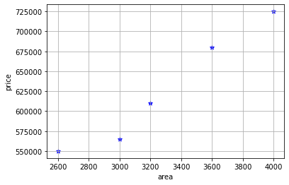
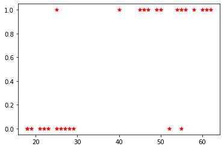

# Linear Regression with Single Variable


```python
import pandas as pd
from sklearn import linear_model
import matplotlib.pyplot as plt
import numpy as np
```


```python
df = pd.read_csv('homeprice.csv')
df
```


<div>
<style scoped>
    .dataframe tbody tr th:only-of-type {
        vertical-align: middle;
    }

    .dataframe tbody tr th {
        vertical-align: top;
    }

    .dataframe thead th {
        text-align: right;
    }
</style>
<table border="1" class="dataframe">
  <thead>
    <tr style="text-align: right;">
      <th></th>
      <th>area</th>
      <th>price</th>
    </tr>
  </thead>
  <tbody>
    <tr>
      <th>0</th>
      <td>2600</td>
      <td>550000</td>
    </tr>
    <tr>
      <th>1</th>
      <td>3000</td>
      <td>565000</td>
    </tr>
    <tr>
      <th>2</th>
      <td>3200</td>
      <td>610000</td>
    </tr>
    <tr>
      <th>3</th>
      <td>3600</td>
      <td>680000</td>
    </tr>
    <tr>
      <th>4</th>
      <td>4000</td>
      <td>725000</td>
    </tr>
  </tbody>
</table>
</div>


```python
%matplotlib inline
plt.xlabel('area')
plt.ylabel('price')
plt.grid()
plt.scatter(df.area, df.price, color = 'blue', marker = '*')
```


    <matplotlib.collections.PathCollection at 0x1ba394dc880>


    

    


```python
new_df = df.drop('price', axis = "columns")
new_df
```


<div>
<style scoped>
    .dataframe tbody tr th:only-of-type {
        vertical-align: middle;
    }

    .dataframe tbody tr th {
        vertical-align: top;
    }

    .dataframe thead th {
        text-align: right;
    }
</style>
<table border="1" class="dataframe">
  <thead>
    <tr style="text-align: right;">
      <th></th>
      <th>area</th>
    </tr>
  </thead>
  <tbody>
    <tr>
      <th>0</th>
      <td>2600</td>
    </tr>
    <tr>
      <th>1</th>
      <td>3000</td>
    </tr>
    <tr>
      <th>2</th>
      <td>3200</td>
    </tr>
    <tr>
      <th>3</th>
      <td>3600</td>
    </tr>
    <tr>
      <th>4</th>
      <td>4000</td>
    </tr>
  </tbody>
</table>
</div>


```python
price = df.price
print(type(price))
np.array(price)
```

    <class 'pandas.core.series.Series'>
    


    array([550000, 565000, 610000, 680000, 725000], dtype=int64)


```python
#create linear regression object
reg = linear_model.LinearRegression()
reg.fit(new_df, price)
```


    LinearRegression()


## (1) Predict price of a home with area = 4500 sft


```python
reg.predict([[4500]])
```


    array([791660.95890411])


```python
reg.coef_ #value of m slope
```


    array([135.78767123])


```python
reg.intercept_ #value of intercept c 
```


    180616.43835616432


## Generate CSV file with list of home price predictions


```python
area_df = pd.read_csv('area.csv')
area_df.head()
```


<div>
<style scoped>
    .dataframe tbody tr th:only-of-type {
        vertical-align: middle;
    }

    .dataframe tbody tr th {
        vertical-align: top;
    }

    .dataframe thead th {
        text-align: right;
    }
</style>
<table border="1" class="dataframe">
  <thead>
    <tr style="text-align: right;">
      <th></th>
      <th>area</th>
    </tr>
  </thead>
  <tbody>
    <tr>
      <th>0</th>
      <td>1000</td>
    </tr>
    <tr>
      <th>1</th>
      <td>1500</td>
    </tr>
    <tr>
      <th>2</th>
      <td>2300</td>
    </tr>
    <tr>
      <th>3</th>
      <td>3540</td>
    </tr>
    <tr>
      <th>4</th>
      <td>4120</td>
    </tr>
  </tbody>
</table>
</div>


```python
p = reg.predict(area_df)
p
```


    array([ 316404.10958904,  384297.94520548,  492928.08219178,
            661304.79452055,  740061.64383562,  799808.21917808,
            926090.75342466,  650441.78082192,  825607.87671233,
            492928.08219178, 1402705.47945205, 1348390.4109589 ,
           1144708.90410959])


```python
area_df['predicted_prices'] = p
area_df
```


<div>
<style scoped>
    .dataframe tbody tr th:only-of-type {
        vertical-align: middle;
    }

    .dataframe tbody tr th {
        vertical-align: top;
    }

    .dataframe thead th {
        text-align: right;
    }
</style>
<table border="1" class="dataframe">
  <thead>
    <tr style="text-align: right;">
      <th></th>
      <th>area</th>
      <th>predicted_prices</th>
    </tr>
  </thead>
  <tbody>
    <tr>
      <th>0</th>
      <td>1000</td>
      <td>3.164041e+05</td>
    </tr>
    <tr>
      <th>1</th>
      <td>1500</td>
      <td>3.842979e+05</td>
    </tr>
    <tr>
      <th>2</th>
      <td>2300</td>
      <td>4.929281e+05</td>
    </tr>
    <tr>
      <th>3</th>
      <td>3540</td>
      <td>6.613048e+05</td>
    </tr>
    <tr>
      <th>4</th>
      <td>4120</td>
      <td>7.400616e+05</td>
    </tr>
    <tr>
      <th>5</th>
      <td>4560</td>
      <td>7.998082e+05</td>
    </tr>
    <tr>
      <th>6</th>
      <td>5490</td>
      <td>9.260908e+05</td>
    </tr>
    <tr>
      <th>7</th>
      <td>3460</td>
      <td>6.504418e+05</td>
    </tr>
    <tr>
      <th>8</th>
      <td>4750</td>
      <td>8.256079e+05</td>
    </tr>
    <tr>
      <th>9</th>
      <td>2300</td>
      <td>4.929281e+05</td>
    </tr>
    <tr>
      <th>10</th>
      <td>9000</td>
      <td>1.402705e+06</td>
    </tr>
    <tr>
      <th>11</th>
      <td>8600</td>
      <td>1.348390e+06</td>
    </tr>
    <tr>
      <th>12</th>
      <td>7100</td>
      <td>1.144709e+06</td>
    </tr>
  </tbody>
</table>
</div>


```python
area_df.to_csv('prediction.csv')
```


```python
from sklearn.metrics import accuracy_score
```

# Logistic regression


```python
import pandas as pd
from matplotlib import pyplot as plt
%matplotlib inline
```


```python
df = pd.read_csv("insurance_data.csv")
df.head()
```


<div>
<style scoped>
    .dataframe tbody tr th:only-of-type {
        vertical-align: middle;
    }

    .dataframe tbody tr th {
        vertical-align: top;
    }

    .dataframe thead th {
        text-align: right;
    }
</style>
<table border="1" class="dataframe">
  <thead>
    <tr style="text-align: right;">
      <th></th>
      <th>age</th>
      <th>bought_insurance</th>
    </tr>
  </thead>
  <tbody>
    <tr>
      <th>0</th>
      <td>22</td>
      <td>0</td>
    </tr>
    <tr>
      <th>1</th>
      <td>25</td>
      <td>0</td>
    </tr>
    <tr>
      <th>2</th>
      <td>47</td>
      <td>1</td>
    </tr>
    <tr>
      <th>3</th>
      <td>52</td>
      <td>0</td>
    </tr>
    <tr>
      <th>4</th>
      <td>46</td>
      <td>1</td>
    </tr>
  </tbody>
</table>
</div>


```python
df.shape
```


    (27, 2)


```python
plt.scatter(df.age, df.bought_insurance, marker = '*', color = 'red')
```


    <matplotlib.collections.PathCollection at 0x237ad3cb910>


    

    


```python
from sklearn.model_selection import train_test_split
```


```python
x_train,x_test,y_train,y_test=train_test_split(df[['age']],df.bought_insurance,test_size=0.3)
```


```python
x_test
```


<div>
<style scoped>
    .dataframe tbody tr th:only-of-type {
        vertical-align: middle;
    }

    .dataframe tbody tr th {
        vertical-align: top;
    }

    .dataframe thead th {
        text-align: right;
    }
</style>
<table border="1" class="dataframe">
  <thead>
    <tr style="text-align: right;">
      <th></th>
      <th>age</th>
    </tr>
  </thead>
  <tbody>
    <tr>
      <th>24</th>
      <td>50</td>
    </tr>
    <tr>
      <th>23</th>
      <td>45</td>
    </tr>
    <tr>
      <th>2</th>
      <td>47</td>
    </tr>
    <tr>
      <th>4</th>
      <td>46</td>
    </tr>
    <tr>
      <th>20</th>
      <td>21</td>
    </tr>
    <tr>
      <th>5</th>
      <td>56</td>
    </tr>
    <tr>
      <th>3</th>
      <td>52</td>
    </tr>
    <tr>
      <th>9</th>
      <td>61</td>
    </tr>
    <tr>
      <th>22</th>
      <td>40</td>
    </tr>
  </tbody>
</table>
</div>


```python
from sklearn.linear_model import LogisticRegression
model = LogisticRegression()
```


```python
model.fit(x_train, y_train)
```


    LogisticRegression()


```python
LogisticRegression()
```


    LogisticRegression()


```python
y_predict = model.predict(x_test)
y_predict
```


    array([1, 1, 1, 1, 0, 1, 1, 1, 0], dtype=int64)


```python
y_test
```


    24    1
    23    1
    2     1
    4     1
    20    0
    5     1
    3     0
    9     1
    22    1
    Name: bought_insurance, dtype: int64


```python
model.predict_proba(x_test)
```


    array([[0.25854679, 0.74145321],
           [0.39992591, 0.60007409],
           [0.33964459, 0.66035541],
           [0.36927551, 0.63072449],
           [0.93723178, 0.06276822],
           [0.13813713, 0.86186287],
           [0.21204541, 0.78795459],
           [0.07737131, 0.92262869],
           [0.56020344, 0.43979656]])


```python
model.score(x_test, y_test)
```


    0.7777777777777778


```python

```


```python

```
